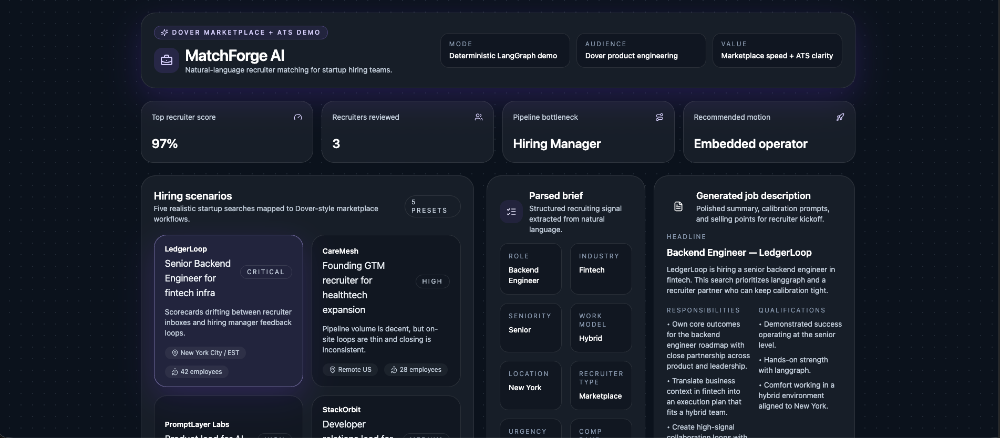
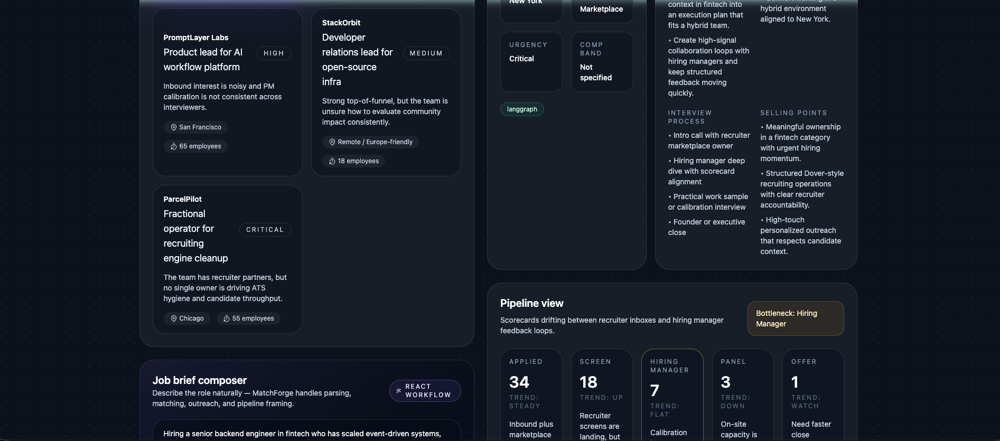
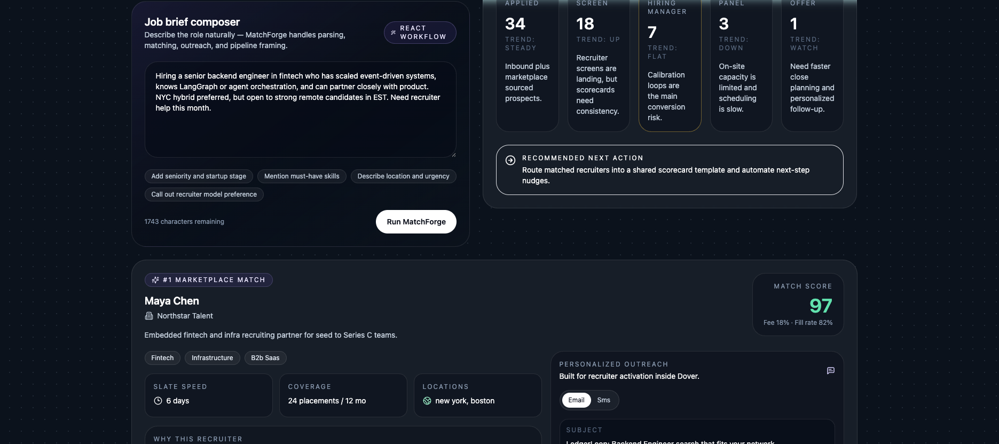
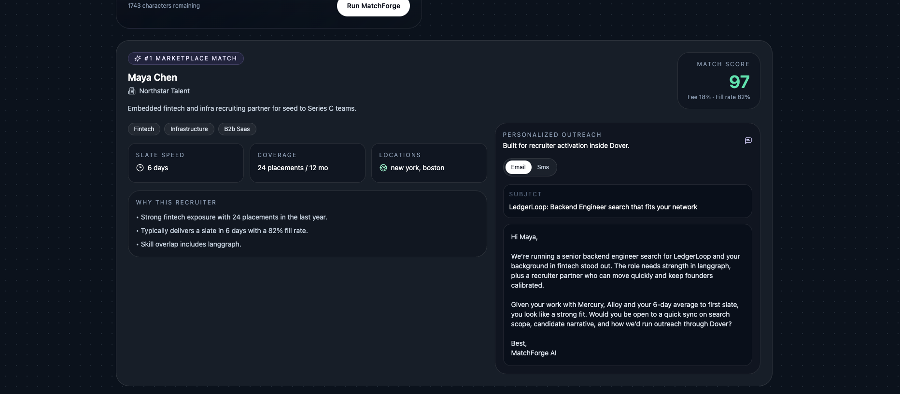
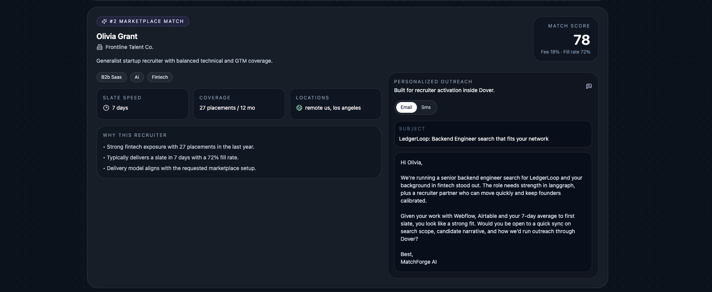
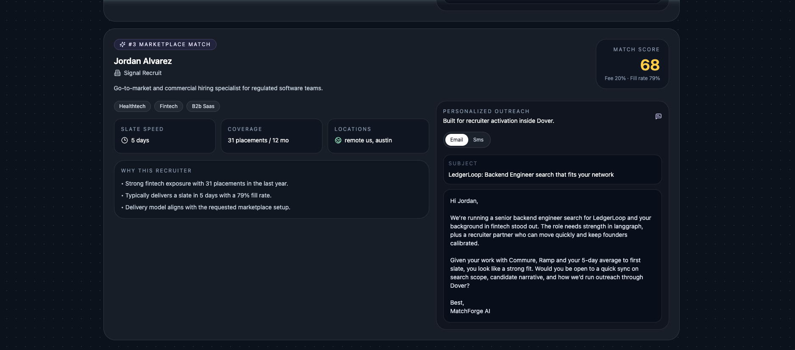

# MatchForge AI

> A full-stack intelligent recruiter marketplace demo purpose-built to mirror Dover's core product: matching startups with the right fractional recruiter, generating personalized outreach, and surfacing ATS pipeline clarity — all from a single natural-language hiring brief.

---

## Screenshots

### 1 · Dashboard — hero metrics and scenario selector


### 2 · Job brief composer


### 3 · Parsed brief + generated job description


### 4 · Recruiter marketplace results


### 5 · Personalized outreach (email + SMS)


### 6 · ATS pipeline view


---

## What is this?

MatchForge AI demonstrates how Dover can combine a **recruiter marketplace** with **ATS-aware recruiting operations** in a single product surface. A hiring manager describes a role in plain English; the app instantly:

1. Parses the brief into structured role criteria (seniority, industry, skills, urgency, location)
2. Scores and ranks the best-fit recruiters from the marketplace with transparent rationale
3. Generates a polished job description ready for recruiter kickoff
4. Creates personalized email and SMS outreach for each matched recruiter
5. Renders a live ATS pipeline snapshot with bottleneck identification and next-action guidance

The workflow runs through a **LangGraph ReAct agent** on the backend — deterministic by default so the demo is reliable in any environment without external LLM credentials.

---

## Tech Stack

| Layer | Technology |
|---|---|
| Frontend | React 18 · TypeScript · Tailwind CSS · Vite |
| State / Data | TanStack Query |
| Backend | Python 3.11 · FastAPI · Pydantic v2 |
| Orchestration | LangGraph (deterministic ReAct graph) |
| Tests | Vitest + Testing Library (FE) · pytest (BE) |
| Deployment | Vercel / Netlify (FE) · Render / Railway (BE) |

---

## Project Structure

```
Dover/
├── frontend/               # React + TypeScript + Tailwind dashboard
│   └── src/
│       ├── components/     # TopBar, ScenarioPanel, BriefComposer,
│       │                   # InsightsPanel, RecruiterGrid, RecruiterCard,
│       │                   # PipelineBoard, StatusBanner, HeroMetrics
│       ├── hooks/          # useMatchForge (React Query wrappers)
│       ├── lib/            # api.ts, utils.ts
│       ├── data/           # fallbackScenarios.ts
│       └── types.ts        # Shared TypeScript types
│
├── backend/
│   └── app/
│       ├── api/            # FastAPI routes
│       ├── core/           # Config, mock recruiter + scenario data
│       ├── graph/          # LangGraph agent (8-node ReAct workflow)
│       ├── services/       # parser.py · scoring.py · generator.py
│       ├── models.py       # Pydantic schemas
│       └── tests/          # pytest API + service tests
│
└── docs/
    ├── product-spec.md
    ├── technical-spec.md
    └── screenshots/
```

---

## Hiring Scenarios

| # | Company | Role | Urgency |
|---|---|---|---|
| 1 | LedgerLoop | Senior Backend Engineer — fintech infra | 🔴 Critical |
| 2 | CareMesh | Founding GTM recruiter — healthtech expansion | 🟠 High |
| 3 | PromptLayer Labs | Product lead — AI workflow platform | 🟠 High |
| 4 | StackOrbit | Developer relations lead — open-source infra | 🟡 Medium |
| 5 | ParcelPilot | Fractional operator — ATS + recruiting cleanup | 🔴 Critical |

---

## LangGraph Workflow

```
sanitize_input
    ↓
parse_brief          ← extracts role, seniority, industry, skills, urgency
    ↓
generate_job_description
    ↓
retrieve_recruiters  ← filters marketplace by domain + function
    ↓
score_recruiters     ← weighted scoring: domain · function · seniority · skills · location · availability
    ↓
generate_outreach    ← personalized email + SMS per recruiter
    ↓
build_pipeline       ← mock ATS snapshot with bottleneck + next action
    ↓
finalize             ← assembles MatchResponse DTO
```

---

## Local Run

### Backend
```bash
cd backend
python -m pip install -e '.[dev]'
uvicorn app.main:app --reload --port 8000
```

### Frontend
```bash
cd frontend
npm install
npm run dev
```

Open `http://localhost:5173`. The frontend calls `http://localhost:8000/api/v1` by default.

---

## API

| Method | Path | Description |
|---|---|---|
| `GET` | `/api/v1/health` | Service health check |
| `GET` | `/api/v1/scenarios` | List five startup hiring scenarios |
| `POST` | `/api/v1/match` | Run the full recruiter matching workflow |

**POST `/api/v1/match` request**
```json
{
  "brief": "Hiring senior backend engineer in fintech who knows LangGraph",
  "scenario_id": "fintech-backend"
}
```

---

## Tests

### Backend — 6 tests
```bash
cd backend && pytest
```
Covers: health check, scenarios endpoint, full match response, brief parsing, prompt-injection stripping, and recruiter scoring accuracy.

### Frontend — 3 tests
```bash
cd frontend && npm test
```
Covers: brief submission flow, short-brief disabled state, recruiter card email/SMS tab switching.

---

## Deployment

| Service | Platform | Env var |
|---|---|---|
| Frontend | Vercel / Netlify | `VITE_API_BASE_URL=https://your-backend.fly.dev/api/v1` |
| Backend | Render / Railway / Fly.io | `MATCHFORGE_FRONTEND_ORIGIN=https://your-frontend.vercel.app` |

Health endpoint: `GET /api/v1/health` — plug into uptime monitors.

---

## Security

- All brief text is treated as untrusted input
- Prompt-injection style phrases are stripped before entering the LangGraph pipeline
- No PII is persisted — all data lives in memory only
- CORS is scoped to the configured frontend origin in production
- No external model calls required in default demo mode

---

## Docs

- [`docs/product-spec.md`](docs/product-spec.md) — user stories, flows, functional + non-functional requirements, edge cases, success criteria
- [`docs/technical-spec.md`](docs/technical-spec.md) — architecture, component structure, LangGraph nodes, Pydantic schemas, API design, scoring strategy
